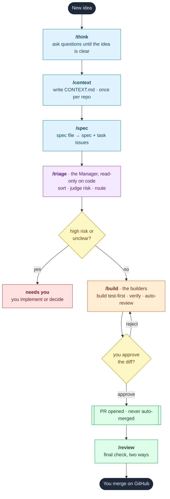

# Muster

**A structured development system, shipped as Agent Skills - harness-agnostic.**
Seven commands take you from a half-formed idea to a merged pull request, with
you in control at every gate. Muster is not tied to any one tool: it ships as
plain [Agent Skills](https://agentskills.io), so it runs in **Claude Code,
Cursor, Codex, Gemini CLI, Mistral, pi**, and any other agent harness that reads
the Agent Skills spec.

[](https://opensource.org/licenses/MIT)
[](https://agentskills.io)
[](https://github.com/markstent/muster/commits/main)
[](https://github.com/markstent/muster/issues)
[](https://github.com/markstent/muster/pulls)

**Runs in:**
[](https://claude.com/claude-code)
[](https://cursor.com)
[](https://developers.openai.com/codex)
[](https://github.com/google-gemini/gemini-cli)
[](https://mistral.ai)
[](https://pi.dev)
[](https://agentskills.io)

*Muster* (verb): to assemble and prepare a force for action. The system musters
your ideas into specs, your specs into tasks, and a fleet of sub-agents into
reviewed, shippable code - and never moves without your say-so.

---

## In plain words

Muster turns a rough idea into shipped code through seven small commands you run
in order. You stay in charge the whole way - it never changes anything important
without asking, and it never merges anything itself.

1. **`/think`** - it asks you questions until the idea is clear.
2. **`/context`** - it writes down how your project works (once per repo).
3. **`/spec`** - it turns the idea into a short plan and a list of small tasks.
4. **`/triage`** - it sorts the tasks and flags which are safe to build on their own.
5. **`/build`** - it builds the safe ones, tests them, checks them, and shows you the result.
6. **`/review`** - one more check before you merge.
7. **You merge.** Always your call.

Lost track? Run **`/status`** any time for a plain summary and what to do next.
New to the terms? See the [Glossary](#glossary).

---

## What it does

Muster is built on two ideas borrowed from disciplined engineering practice:

1. **Plan before you code.** Most agent failures aren't the model writing bad
   code - they're requirements that were never pinned down. Muster makes you
   talk the idea through and write a short plan before a single line is written.
2. **Separate deciding from doing.** One part (the Manager) reads your code and
   decides what's safe to build; another (the builders) builds it, proves it
   with tests, checks its own work, and waits for your approval before opening a
   PR.

Nothing is ever auto-merged. You are the merge gate, always.

---

## The seven commands

| Command | Phase | Role | What it does |
|---|---|---|---|
| `/think` | Plan | You + agent | Asks about your idea until every open question is settled |
| `/context` | Plan | Agent | Writes and maintains `CONTEXT.md` - the shared project notes |
| `/spec` | Plan | Agent | Writes a spec issue + small task issues on GitHub |
| `/triage` | Manage | **the Manager** | Sorts tasks, judges risk, marks the safe ones ready |
| `/build` | Execute | **the builders** | Builds tasks test-first, auto-reviews them, waits for you |
| `/review` | Review | Agent | Checks a change two ways (conventions + matches the issue) before you merge |
| `/status` | Any time | Agent | Snapshot of where everything stands and what to do next |

> **Command names.** Installed as a plugin, the commands are namespaced:
> `/muster:think`, `/muster:build`, and so on (no collisions with your own
> commands). Installed via the script, they are the bare names shown above.
> This README uses the bare names for readability.

---

## Installation

### Prerequisites

- Any agent harness that reads the [Agent Skills spec](https://agentskills.io).
  Muster is harness-agnostic - it works in
  [Claude Code](https://claude.com/claude-code),
  [Cursor](https://cursor.com),
  [Codex](https://developers.openai.com/codex),
  [Gemini CLI](https://github.com/google-gemini/gemini-cli),
  [Mistral](https://mistral.ai),
  [pi](https://pi.dev), and others. Any harness with a shell/bash tool
  works; Muster needs no MCP server, it shells out to `gh` and `git` directly.
- [GitHub CLI](https://cli.github.com/) installed and authenticated:
  ```bash
  gh auth login
  ```
- A git remote pointing at GitHub

> The plugin (Option A) is Claude Code-only. For everything else - including
> Claude Code if you prefer bare `/think` names - use the script in Option B,
> which installs into every harness it finds.

### Option A - plugin (recommended)

Inside Claude Code:

```
/plugin marketplace add markstent/muster
/plugin install muster@muster
```

Commands appear as `/muster:think`, `/muster:spec`, and so on.

### Option B - script (any harness, bare command names)

One command clones Muster to `~/.muster` and symlinks the skills into **every
harness it finds** - Claude Code, Mistral (Vibe), Codex, Gemini, Cursor - so
they're available as `/think`, `/spec`, etc.:

```bash
curl -fsSL https://raw.githubusercontent.com/markstent/muster/main/install.sh | bash
```

Because they're symlinks to that one clone, a later `git -C ~/.muster pull`
updates every harness at once - nothing to re-copy.

Want to target specific harnesses, or copy the files instead of symlinking?

```bash
bash install.sh claude vibe      # only these (creates their skills dir if needed)
MUSTER_COPY=1 bash install.sh    # copy the files instead of symlinking
```

### Other harnesses

Muster's seven commands are plain [Agent Skills](https://agentskills.io):
`skills/<name>/SKILL.md`, each with `name` + `description` frontmatter. The
script in Option B already installs into the common ones (Claude Code, Mistral,
Codex, Gemini, Cursor). For any harness it doesn't know, point that tool's
skills directory at the clone yourself - copy or symlink the `skills/` tree in:

```bash
git clone https://github.com/markstent/muster.git ~/.muster
cp -R ~/.muster/skills/* <that-harness's-skills-dir>/
```

Each tool decides where it reads skills from (the Agent Skills spec standardises
the file format, not the location), so check your harness's docs for the path -
e.g. Mistral (Vibe) reads `~/.vibe/skills/`, just as Claude Code reads
`~/.claude/skills/` and Codex reads `~/.codex/skills/`.

The skill bodies are identical across harnesses and tool-neutral - they describe
what the agent should do, not one tool's API. Cross-references between commands
(`run /spec`, `run /triage`) resolve because the skill names match.

One behaviour varies by harness: `/build` fans out parallel builders (sub-agents)
to do the work. Harnesses differ in whether and how they support parallel
sub-agents; the skill degrades gracefully - worst case it does the work in the
main thread instead of fanning out. The frontmatter
field `disable-model-invocation: true` keeps each command slash-only in Claude
Code (so the model never auto-fires `/build` or `/triage`); other harnesses
ignore the unknown field.

### Updating

**Plugin (Option A)** - inside Claude Code:

```
/plugin marketplace update muster
/plugin update muster@muster
```

Then reload Claude Code (or restart) so the new command files take effect.
Run `/plugin` to confirm muster shows the new version.

**Script (Option B):**

```bash
git -C ~/.muster pull
```

The symlinks point at the skill directories in the clone, so the new versions
are live across every harness immediately. (If you installed with
`MUSTER_COPY=1`, or copied the tree manually, re-run the installer after pulling
to refresh the copies.)

Each version's changes are on the
[releases page](https://github.com/markstent/muster/releases).

### First-time repo setup (both options)

Create the GitHub labels Muster uses, once per repo:

```bash
bash ~/.muster/setup-labels.sh
```

(If you installed via the plugin, run `setup-labels.sh` from a clone of this
repo - it only needs `gh` authenticated against the target repo.)

---

## The flow



**Colour key:** blue = Plan (you + agent) · purple = Manage (the Manager, read-only) ·
orange = Execute (the builders) · yellow = your decision gates ·
green = ship and merge · red = back to you.

`/status` sits outside the line: run it any time to see where everything is and
what to do next. The diagram shows the happy path; the granular tutorial below
walks every gate, label change, and decision point one command at a time.

---

## The two parts: the Manager and the builders

```
            +------------------------------------+
            | THE MANAGER                        |
            | /triage                            |
            | reads your code + CONTEXT.md       |
            | writes labels + comments only      |
            | sorts, judges risk, routes         |
            | never changes code                 |
            +-----------------+------------------+
                           | tasks marked agent-ready
                           v
            +------------------------------------+
            | THE BUILDERS                       |
            | /build                             |
            | build each task, test-first        |
            | re-run the tests to be sure        |
            | auto-review every change           |
            | wait for your approval             |
            | open PRs (never merge)             |
            +-----------------+------------------+
                           | approved changes
                           v
                    PR opened - you merge
```

---

## Label system

| Label | Set by | Meaning |
|---|---|---|
| `spec` | /spec | Parent spec issue |
| `task` | /spec | A buildable unit of work |
| `ready` | /spec | Awaiting triage |
| `bug` | /triage | Category: something is broken |
| `enhancement` | /triage | Category: new feature or improvement |
| `needs-triage` | /triage | Awaiting evaluation |
| `needs-info` | /triage | Waiting on you for detail |
| `agent-ready` | /triage | Cleared for /build to execute |
| `needs-human-input` | /triage | Needs your implementation or decision |
| `wontfix` | /triage | Will not be actioned |
| `risk:low` / `risk:medium` / `risk:high` | /triage | Risk assessment |
| `on-hold` | /build | Skipped by you during a medium-risk pause |
| `in-review` | /build | PR is open, awaiting your merge |
| `needs-work` | /build or /review | Rejected - needs changes |
| `blocked` | /build | Sub-agent hit an unresolvable problem |

Create them all in one go:

```bash
bash setup-labels.sh
```

---

## Tutorial: from idea to a merged PR

This is the whole pipeline, one command at a time, following a single example:
adding a rate limiter to an API. For each step you get what you type, what
Muster does under the hood, where it stops for you, and which labels move.

Run the commands in order. The only setup you do once per repo is `/context`
and `setup-labels.sh`; everything else repeats per idea.

### 1. `/think` - resolve the idea

**You type:** `/think`, then `I want a rate limiter for my API.`

**What happens:** Muster asks you one question at a time, and for each one it
offers its own recommended answer so you can just confirm or correct. It works
through every open question - algorithm, where state lives, per-key vs global,
the limits, what's explicitly out of scope - and treats vague answers
("roughly", "something like that") as unresolved and asks again. If a question
can be answered by reading the code, it reads the code instead of asking. It
writes nothing: the result is you and Muster agreeing on what to build, not a
file.

**The gate:** It ends by summarising problem, solution, done-criteria, and
non-goals, and asks whether that matches. Correct it and it re-summarises;
confirm and it prints `Next: run /spec`.

### 2. `/context` - write the shared notes (once per repo)

**You type:** `/context`

**What happens:** Muster reads your README, recent git log, package manifests,
and any existing recorded decisions / CONTRIBUTING / CLAUDE.md, then writes a
single file, `CONTEXT.md`, at the repo root: your stack (including a
`Test command:` that runs the full suite), a glossary of your project's terms,
architecture, conventions, dated decisions, and out-of-scope notes. Every later
command reads this file, so the agents speak your project's language and respect
your past choices. The `Test command:` is required for the autonomous path:
`/build` re-runs it to check each task, and `/triage` won't mark work
agent-ready without it.

**The gate:** None, beyond a targeted question if something central is
ambiguous. On later runs it refreshes in place and flags before removing any
existing decision. Skip this step on repos where `CONTEXT.md` already exists and
is current.

### 3. `/spec` - turn the idea into issues

**You type:** `/spec`

**What happens:** Working from the `/think` conversation (it does not
re-interview), Muster works out where the feature will be tested, then writes one
markdown file, `docs/specs/<date>-<slug>.md`, containing the spec (Problem /
Solution / a focused User stories list / Test points / Done when / Out of scope /
Touches) and every task as a small, self-contained piece - marked for whether an
agent can build it alone (`auto`) or it needs you (`needs-you`), with clear
done-criteria and a scope boundary. It writes the file but does not print it
back, and creates nothing on GitHub yet.

**The gate:** It prints the task breakdown (each one with that tag and its files)
and asks you to sanity-check the split - sizes, any merge/split, the tags -
before any issue exists. Edit the file directly in your editor, then reply
`create` to generate the issues, or `cancel` to stop (the file stays on disk). On
`create` it re-reads the file so your edits win, then creates the spec issue
(label `spec`) and one task issue per piece (labels `task` + `ready`),
cross-links them, and commits just the spec file.

**Labels after:** spec issue -> `spec`; each task -> `task` + `ready`.

> Tasks are meant to touch separate files so each can build and merge on its own.
> If two tasks must touch the same file, `/spec` flags it at the review gate, and
> `/build` holds the later one back ("merge PR #N first") until the earlier PR is
> merged - Muster never auto-merges to unblock it. Prefer one larger task over
> two that share files.

### 4. `/triage` - the Manager decides what is safe

**You type:** `/triage`

**What happens:** This is the Manager. It can read your code but only writes
labels and comments - it never branches, edits, or runs tests. It
takes up to 10 open `task` issues, oldest first, reads each against `CONTEXT.md`
and the code, reproduces bugs by reasoning through the path, and recommends a
category (`bug` / `enhancement`), a risk (`risk:low` / `medium` / `high`), and a
state. Risk gates autonomy: `agent-ready` only if risk is low, or medium with
complete, unambiguous criteria. High risk, vagueness, a clash with CONTEXT.md, or
no `Test command:` in CONTEXT.md (which /build needs to verify the work) routes to
`needs-human-input` instead. In our example the token
bucket and middleware tasks come back `risk:low` and `agent-ready`; a session
schema change is `risk:high`, so it goes to `needs-human-input`.

**The gate:** It recommends and waits for your direction unless you told it to
act autonomously. You can override with "move #42 to agent-ready" and it
confirms before acting. Every comment it posts starts with
`> *Generated by Muster triage.*`.

**Labels after:** each task gets exactly one state label and a `risk:*` label;
`agent-ready` tasks keep `ready`; `needs-info` / `needs-human-input` drop
`ready`.

### 5. `/build` - the builders build it

**You type:** `/build`

**What happens:** First it checks the tree is clean, you are on the base branch,
`gh` is authenticated, and CONTEXT.md has a `Test command:` to check against (it
stops and points you to `/context` if not). It fetches `agent-ready` + `ready`
tasks, capped at 3 per run (so nothing runs away), and prints a plan: tasks that
touch different files run together, tasks that share files run one after another.

**Gate A - start:** Reply `yes` to begin, or name issue numbers to skip. Before
starting any `risk:medium` task it pauses 10 seconds so you can type `hold [N]`
to skip it (skipped -> `on-hold`); low-risk tasks start immediately.

It then hands each task to a builder. Each builder makes its own branch
(`task/[N]-[slug]`) and works test-first: write one failing test through the
named test point, write the least code to make it pass, repeat - never all the
tests up front - then tidy up only once everything's green, touching only files
in scope. Muster then checks each result (it passed, the changes match the
declared scope, there's at least one commit, no quiet out-of-scope work) and
re-runs the whole test suite itself against the branch - its own run is what
counts, and the builder's pasted output has to match it. A failure labels the
task `blocked` and is surfaced, not hidden.

Every task that passes then gets an automatic review that checks it two ways,
kept separate so one can't hide the other: does it follow your conventions (and
is it secure), and does it do what the issue asked? Either one failing labels the
task `needs-work` and it never reaches you; anything security-related is always a
fail.

**Gate B - approval:** Once the batch is built and reviewed, it prints a table of
what's ready (with its conventions / matches-the-issue verdicts) and what isn't,
then waits. Your options:

- `[N]` (a number) - print the full diff for that task, then re-ask.
- `approve [N]` / `approve all` - open the PR(s), never merge.
- `reject [N]` - it asks what needs to change, posts your reason as a comment.
- `stop` - pause and exit; labels are already applied, so nothing is lost.

On approval it opens a PR (`Closes #N`, linked to the spec, with the builder's
summary, the review verdict, and test output), then prints
`PR opened for #N. You merge when ready - never auto-merged.`

**Labels after:** approved -> `in-review`, drops `ready` + `agent-ready`;
rejected -> `needs-work`; blocked -> `blocked`; held -> `on-hold`.

### 6. `/review` - optional final check on a PR

**You type:** `/review 13` (or a SHA, branch, tag, or `main`)

**What happens:** A read-only review of the diff against the fixed point you
supply, checked two ways. It finds the originating issue from the commit
messages, then checks the change against your conventions and against what the
issue asked for, and reports one compact, verdict-first summary: `SAFE TO MERGE`
or `DO NOT MERGE`. A security finding, or work that doesn't match the issue, is
always `DO NOT MERGE`. It suggests nothing beyond those two checks and never
modifies code.

**The gate:** Advisory. It tells you whether to merge; it does not merge.

### 7. You merge

Merging is always manual and always yours - Muster never auto-merges. Merge the
PR on GitHub when you are satisfied.

### Any time: `/status`

**You type:** `/status`

**What happens:** A read-only snapshot of the whole pipeline: open specs, every
task bucketed by its state label, open PRs, recent commits, and a prioritised
"what to do next" (merge a waiting PR > `/build` ready tasks > `/triage` the
queue, and so on). It changes nothing. In our example it would still show the
`risk:high` schema task sitting in `needs-human-input` for you to handle.

---

## Design decisions

**You approve every task before its PR opens.** The build loop always stops and
waits. You can inspect the full diff, approve, reject, or stop entirely.

**The Manager never touches code.** `/triage` has read-only access to the
codebase and writes only labels and comments. Deciding and doing are separated
so a routing mistake can't become a code mistake.

**Risk gates autonomy.** High-risk work (schema, auth, public API, security)
never reaches the autonomous loop. Medium-risk work pauses for you. Low-risk
work flows.

**Test-first, in small slices.** The builders write one test, make it pass, then
move on - never all the tests up front, which produces tests of imagined rather
than actual behaviour. Tests target behaviour through public interfaces, so they
survive refactors. Muster doesn't take the builder's word for it: it re-runs the
suite itself against each branch and gates on its own result, so a fabricated or
stale test report can't pass. This needs a `Test command:` in CONTEXT.md, which
/triage requires before a task is agent-ready.

**Checked two ways.** Code is checked separately for whether it follows your
conventions and whether it matches the issue. A change can pass one and fail the
other; keeping them apart stops one hiding the other.

**CONTEXT.md is the shared notes.** Every command reads it, so the agents speak
your project's language and respect your past decisions.

**Three caps stop runaway loops.** Triage handles at most 10 issues per run;
build handles at most 3 tasks per run with at most 3 builders at once.

---

## Glossary

Plain meanings for the words Muster uses, in its output and in this README:

| Term | What it means |
|------|---------------|
| **Spec** | A short written plan for one feature: the problem, the solution, and how you'll know it's done. |
| **Task** | One small, self-contained piece of a spec that can be built and merged on its own. |
| **Agent-ready** | A task that's clear and safe enough for Muster to build on its own. |
| **Needs you** | A task that needs a human decision, or is too risky to automate. |
| **Risk: low / medium / high** | How much a change could break things. Low = contained to one area; high = touches schemas, auth, payments, or public APIs. |
| **The Manager** (`/triage`) | The part that reads your code and decides what's safe to build. It never changes code. |
| **The builders** (`/build`) | The parts that actually write the code, one test at a time. |
| **Conventions check** | Does the new code follow your project's documented style and rules? |
| **Matches the issue** | Does the new code do what the task asked for - no more, no less? |
| **PR (pull request)** | A proposed change on GitHub that you review and merge. Muster opens these; it never merges them. |
| **`CONTEXT.md`** | The shared notes (`/context` writes it) that every command reads, so they all understand your project. |

---

## Project layout

```
.claude-plugin/
  plugin.json        plugin manifest
  marketplace.json   makes this repo its own single-plugin marketplace
skills/
  think/SKILL.md     -> /think
  context/SKILL.md   -> /context
  spec/SKILL.md      -> /spec
  triage/SKILL.md    -> /triage
  build/SKILL.md     -> /build
  review/SKILL.md    -> /review
  status/SKILL.md    -> /status
setup-labels.sh      create the GitHub labels (once per repo)
install.sh           non-plugin install (clone + symlink skills)
README.md
CONTRIBUTING.md
LICENSE

# Generated at your repo root by /context:
CONTEXT.md
```

---

## Credit and lineage

The planning and review philosophy draws on
[Matt Pocock's skills for real engineers](https://github.com/mattpocock/skills) -
specifically the question-everything approach (`/think`), the triage roles and
agent-ready routing (`/triage`), test-first vertical slices (`/build`), the
two-way review (`/review`), and the spec-as-source-of-truth idea (`/spec`). The
Manager/builder split, the risk-gated autonomous loop, the per-run caps, and the
terminal approval gates are Muster's own.

If you want the original, broader skill set (handoff, diagnose, prototype,
zoom-out, and more), install Pocock's directly - Muster is a focused,
opinionated subset wired for autonomous building.

---

## Contributing

See [CONTRIBUTING.md](CONTRIBUTING.md).

---

## License

MIT. See [LICENSE](LICENSE).
