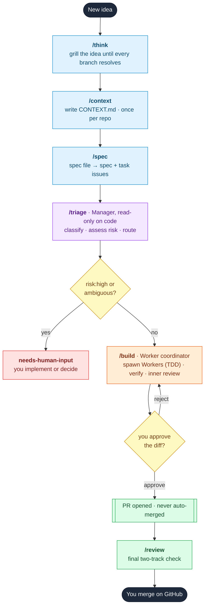

# Muster

**A structured development system for Claude Code.** Seven commands take you
from a half-formed idea to a merged pull request, with you in control at every
gate.

[](https://opensource.org/licenses/MIT)
[](https://claude.com/claude-code)
[](https://github.com/markstent/muster/commits/main)
[](https://github.com/markstent/muster/issues)
[](https://github.com/markstent/muster/pulls)

*Muster* (verb): to assemble and prepare a force for action. The system musters
your ideas into specs, your specs into tasks, and a fleet of sub-agents into
reviewed, shippable code - and never moves without your say-so.

---

## What it does

Muster is built on two ideas borrowed from disciplined engineering practice and
wired into a two-tier agent loop:

1. **Plan before you code.** Most agent failures aren't the model writing bad
   code - they're requirements that were never fully specified. Muster forces a
   grilling session and a written spec before a single line is written.
2. **Separate deciding from doing.** A read-only Manager agent decides what is
   safe to build; a Worker coordinator builds it, proves it with tests, reviews
   its own diffs, and waits for your approval before opening a PR.

Nothing is ever auto-merged. You are the merge gate, always.

---

## The seven commands

| Command | Phase | Role | What it does |
|---|---|---|---|
| `/think` | Plan | You + agent | Interrogates your idea until every decision branch is resolved |
| `/context` | Plan | Agent | Builds and maintains `CONTEXT.md` - shared domain memory |
| `/spec` | Plan | Agent | Writes a spec issue + vertical-slice task issues on GitHub |
| `/triage` | Manage | **Manager** | State machine: classifies, assesses risk, routes work |
| `/build` | Execute | **Worker coordinator** | Spawns sub-agents, builds with TDD, auto-reviews, waits for you |
| `/review` | Review | Agent | Two-track review (Standards + Spec) before you merge |
| `/status` | Any time | Agent | Snapshot of the whole pipeline and what to do next |

> **Command names.** Installed as a plugin, the commands are namespaced:
> `/muster:think`, `/muster:build`, and so on (no collisions with your own
> commands). Installed via the symlink script, they are the bare names shown
> above. This README uses the bare names for readability.

---

## Installation

### Prerequisites

- [Claude Code](https://claude.com/claude-code) installed
- [GitHub CLI](https://cli.github.com/) installed and authenticated:
  ```bash
  gh auth login
  ```
- A git remote pointing at GitHub

### Option A - plugin (recommended)

Inside Claude Code:

```
/plugin marketplace add markstent/muster
/plugin install muster@muster
```

Commands appear as `/muster:think`, `/muster:spec`, and so on.

### Option B - symlink (bare command names)

Clone and symlink the commands into `~/.claude/commands/` so they are available
globally as `/think`, `/spec`, etc.:

```bash
curl -fsSL https://raw.githubusercontent.com/markstent/muster/main/install.sh | bash
```

Or manually:

```bash
git clone https://github.com/markstent/muster.git ~/.muster
mkdir -p ~/.claude/commands
ln -sf ~/.muster/commands/*.md ~/.claude/commands/
```

### Updating

**Plugin (Option A)** - inside Claude Code:

```
/plugin marketplace update muster
/plugin update muster@muster
```

Then reload Claude Code (or restart) so the new command files take effect.
Run `/plugin` to confirm muster shows the new version.

**Symlink (Option B):**

```bash
git -C ~/.muster pull
```

The symlinks point at the files, so the new versions are live immediately.

Each version's changes are on the
[releases page](https://github.com/markstent/muster/releases).

### First-time repo setup (both options)

Create the GitHub labels Muster uses, once per repo:

```bash
bash ~/.muster/setup-labels.sh
```

(If you installed via the plugin, run `setup-labels.sh` from a clone of this
repo - it only needs `gh` authenticated against the target repo.)

---

## The flow



**Colour key:** blue = Plan (you + agent) · purple = Manage (Manager, read-only) ·
orange = Execute (Worker coordinator) · yellow = your decision gates ·
green = ship and merge · red = back to you.

`/status` sits outside the line: run it any time to see where everything is and
what to do next. The diagram shows the happy path; the granular tutorial below
walks every gate, label change, and decision point one command at a time.

---

## Two-tier agent architecture

```
            +----------------------------------+
            |          MANAGER AGENT           |
            |             /triage              |
            |  reads codebase + CONTEXT.md     |
            |  writes labels + comments only   |
            |  classifies, assesses risk,      |
            |  routes. Never touches code.     |
            +----------------+-----------------+
                             | agent-ready tasks
                             v
            +----------------------------------+
            |       WORKER COORDINATOR         |
            |             /build               |
            |  spawns Worker sub-agents (TDD)  |
            |  verifies results                |
            |  fires two-track inner review     |
            |  waits for your approval         |
            |  opens PRs (never merges)        |
            +----------------+-----------------+
                             | approved diffs
                             v
                     PR opened - you merge
```

---

## Label system

| Label | Set by | Meaning |
|---|---|---|
| `spec` | /spec | Parent spec issue |
| `task` | /spec | A buildable unit of work |
| `ready` | /spec | Awaiting triage |
| `bug` | /triage | Category: something is broken |
| `enhancement` | /triage | Category: new feature or improvement |
| `needs-triage` | /triage | Awaiting evaluation |
| `needs-info` | /triage | Waiting on you for detail |
| `agent-ready` | /triage | Cleared for /build to execute |
| `needs-human-input` | /triage | Needs your implementation or decision |
| `wontfix` | /triage | Will not be actioned |
| `risk:low` / `risk:medium` / `risk:high` | /triage | Risk assessment |
| `on-hold` | /build | Skipped by you during a medium-risk pause |
| `in-review` | /build | PR is open, awaiting your merge |
| `needs-work` | /build or /review | Rejected - needs changes |
| `blocked` | /build | Sub-agent hit an unresolvable problem |

Create them all in one go:

```bash
bash setup-labels.sh
```

---

## Tutorial: from idea to a merged PR

This is the whole pipeline, one command at a time, following a single example:
adding a rate limiter to an API. For each step you get what you type, what
Muster does under the hood, where it stops for you, and which labels move.

Run the commands in order. The only setup you do once per repo is `/context`
and `setup-labels.sh`; everything else repeats per idea.

### 1. `/think` - resolve the idea

**You type:** `/think`, then `I want a rate limiter for my API.`

**What happens:** Muster interviews you one question at a time, and for each
question it offers its own recommended answer so you can just confirm or
correct. It walks the decision tree - algorithm, where state lives, per-key vs
global, the limits, what is explicitly out of scope - and treats vague answers
("roughly", "something like that") as unresolved and asks again. If a question
can be answered by reading the code, it reads the code instead of asking. It
writes nothing: the output is shared understanding, not a file.

**The gate:** It ends by summarising problem, solution, done-criteria, and
non-goals, and asks whether that matches. Correct it and it re-summarises;
confirm and it prints `Next: run /spec`.

### 2. `/context` - write the shared brain (once per repo)

**You type:** `/context`

**What happens:** Muster reads your README, recent git log, package manifests,
and any existing ADRs / CONTRIBUTING / CLAUDE.md, then writes a single file,
`CONTEXT.md`, at the repo root: stack (including a `Test command:` that runs the
full suite), a domain glossary, architecture, conventions, dated decisions, and
out-of-scope notes. Every later command reads this file, so sub-agents speak your
vocabulary and respect your prior choices. The `Test command:` is required for the
autonomous path: `/build` re-runs it to verify each task, and `/triage` won't mark
work agent-ready without it.

**The gate:** None, beyond a targeted question if something central is
ambiguous. On later runs it refreshes in place and flags before removing any
existing decision. Skip this step on repos where `CONTEXT.md` already exists and
is current.

### 3. `/spec` - turn the idea into issues

**You type:** `/spec`

**What happens:** Working from the `/think` conversation (it does not
re-interview), Muster sketches the test points, then writes one markdown file,
`docs/specs/<date>-<slug>.md`, containing the spec (Problem / Solution / a
focused User stories list / Test points / Done when / Out of scope / Touches) and
every task as a vertical slice tagged `AFK` or `HITL` (a hint to triage), with
concrete acceptance criteria and a scope boundary. It writes the file but does
not print it back, and creates nothing on GitHub yet.

**The gate:** It prints the slice breakdown (each slice with its AFK/HITL tag and
files) and asks you to sanity-check the cut - granularity, any split/merge, the
tags - before any issue exists. Edit the file directly in your editor, then reply
`create` to generate the issues, or `cancel` to stop (the file stays on disk). On
`create` it re-reads the file so your edits win, then creates the spec issue
(label `spec`) and one task issue per slice (labels `task` + `ready`),
cross-links them, and commits just the spec file.

**Labels after:** spec issue -> `spec`; each task -> `task` + `ready`.

> Slices are meant to be file-disjoint so each can build and merge alone. If two
> slices must touch the same file, `/spec` flags it at the review gate, and
> `/build` defers the later one ("merge PR #N first") until the earlier PR is
> merged - Muster never auto-merges to unblock it. Prefer one larger task over
> same-file slices.

### 4. `/triage` - the Manager decides what is safe

**You type:** `/triage`

**What happens:** This is the Manager agent. It has read-only access to code and
writes only labels and comments - it never branches, edits, or runs tests. It
takes up to 10 open `task` issues, oldest first, reads each against `CONTEXT.md`
and the code, reproduces bugs by reasoning through the path, and recommends a
category (`bug` / `enhancement`), a risk (`risk:low` / `medium` / `high`), and a
state. Risk gates autonomy: `agent-ready` only if risk is low, or medium with
complete, unambiguous criteria. High risk, vagueness, a clash with CONTEXT.md, or
no `Test command:` in CONTEXT.md (which /build needs to verify the work) routes to
`needs-human-input` instead. In our example the token
bucket and middleware tasks come back `risk:low` and `agent-ready`; a session
schema change is `risk:high`, so it goes to `needs-human-input`.

**The gate:** It recommends and waits for your direction unless you told it to
act autonomously. You can override with "move #42 to agent-ready" and it
confirms before acting. Every comment it posts starts with
`> *Generated by Muster triage.*`.

**Labels after:** each task gets exactly one state label and a `risk:*` label;
`agent-ready` tasks keep `ready`; `needs-info` / `needs-human-input` drop
`ready`.

### 5. `/build` - the Worker coordinator builds it

**You type:** `/build`

**What happens:** First it checks the tree is clean, you are on the base branch,
`gh` is authenticated, and CONTEXT.md has a `Test command:` to verify against (it
stops and points you to `/context` if not). It fetches `agent-ready` + `ready`
tasks, capped at 3
per run (the burnout cap), and prints an execution plan: tasks touching
different files run in parallel, tasks sharing files run sequentially.

**Gate A - start:** Reply `yes` to begin, or name issue numbers to skip. Before
spawning any `risk:medium` task it pauses 10 seconds so you can type `hold [N]`
to skip it (skipped -> `on-hold`); low-risk tasks start immediately.

It then spawns a Worker sub-agent per task. Each Worker branches
(`task/[N]-[slug]`) and works in vertical-slice TDD: one failing test through
the named test point, minimum code to pass, repeat - never all tests up front - then
refactors only on green, and touches only files in scope. The coordinator
verifies each returned report (status PASS, diff matches declared scope, at least
one commit, no silent out-of-scope work) and independently re-runs the test suite
against the branch - its own run is the gate, and the Worker's pasted output must
match it. A failure labels the task `blocked` and is surfaced, not hidden.

Every task that passes verification then goes through an automatic inner review:
two sub-agents in parallel, Standards (conventions + security) and Spec (does
the diff match the issue?), kept separate so one cannot mask the other. Either
track failing labels the task `needs-work` and it never reaches you; a
security-relevant finding is always a fail.

**Gate B - approval:** Once the batch is verified and reviewed, it prints a
"batch complete" table of what is ready (with its Standards / Spec verdicts) and
what is not, then waits. Your options:

- `[N]` (a number) - print the full diff for that task, then re-ask.
- `approve [N]` / `approve all` - open the PR(s), never merge.
- `reject [N]` - it asks what needs to change, posts your reason as a comment.
- `stop` - pause and exit; labels are already applied, so nothing is lost.

On approval it opens a PR (`Closes #N`, linked to the spec, with the worker
summary, inner-review verdict, and test output), then prints
`PR opened for #N. You merge when ready - never auto-merged.`

**Labels after:** approved -> `in-review`, drops `ready` + `agent-ready`;
rejected -> `needs-work`; blocked -> `blocked`; held -> `on-hold`.

### 6. `/review` - optional final check on a PR

**You type:** `/review 13` (or a SHA, branch, tag, or `main`)

**What happens:** A read-only two-track review of the diff against the fixed
point you supply. It finds the originating issue from the commit messages, then
runs Standards and Spec sub-agents in parallel and reports one compact,
verdict-first summary: `SAFE TO MERGE` or `DO NOT MERGE`. A security finding or
a Spec fail is always `DO NOT MERGE`. It suggests nothing beyond the two tracks
and never modifies code.

**The gate:** Advisory. It tells you whether to merge; it does not merge.

### 7. You merge

Merging is always manual and always yours - Muster never auto-merges. Merge the
PR on GitHub when you are satisfied.

### Any time: `/status`

**You type:** `/status`

**What happens:** A read-only snapshot of the whole pipeline: open specs, every
task bucketed by its state label, open PRs, recent commits, and a prioritised
"what to do next" (merge a waiting PR > `/build` ready tasks > `/triage` the
queue, and so on). It changes nothing. In our example it would still show the
`risk:high` schema task sitting in `needs-human-input` for you to handle.

---

## Design decisions

**You approve every task before its PR opens.** The build loop always stops and
waits. You can inspect the full diff, approve, reject, or stop entirely.

**The Manager never touches code.** `/triage` has read-only access to the
codebase and writes only labels and comments. Deciding and doing are separated
so a routing mistake can't become a code mistake.

**Risk gates autonomy.** High-risk work (schema, auth, public API, security)
never reaches the autonomous loop. Medium-risk work pauses for you. Low-risk
work flows.

**TDD in vertical slices.** Workers write one test, make it pass, then move on -
never all tests up front, which produces tests of imagined rather than actual
behaviour. Tests target behaviour through public interfaces, so they survive
refactors. The coordinator does not take the Worker's word for it: it re-runs the
suite itself against each branch and gates on its own result, so a fabricated or
stale test report cannot pass. This needs a `Test command:` in CONTEXT.md, which
/triage requires before a task is agent-ready.

**Two-track review.** Code is checked separately for conventions (Standards) and
for matching the issue (Spec). A change can pass one and fail the other; keeping
them apart stops one masking the other.

**CONTEXT.md is the shared brain.** Every command reads it, so sub-agents speak
your domain language and respect your prior decisions.

**Three caps stop runaway loops.** Triage handles at most 10 issues per run;
build handles at most 3 tasks per run with at most 3 concurrent Workers.

---

## Project layout

```
.claude-plugin/
  plugin.json        plugin manifest
  marketplace.json   makes this repo its own single-plugin marketplace
commands/
  think.md     -> /think
  context.md   -> /context
  spec.md      -> /spec
  triage.md    -> /triage
  build.md     -> /build
  review.md    -> /review
  status.md    -> /status
setup-labels.sh      create the GitHub labels (once per repo)
install.sh           non-plugin install (clone + symlink commands)
README.md
CONTRIBUTING.md
LICENSE

# Generated at your repo root by /context:
CONTEXT.md
```

---

## Credit and lineage

The planning and review philosophy draws on
[Matt Pocock's skills for real engineers](https://github.com/mattpocock/skills) -
specifically the grilling approach (`/think`), the triage state machine and
agent-ready routing (`/triage`), vertical-slice TDD (`/build`), two-track review
(`/review`), and the spec-as-source-of-truth idea (`/spec`). The two-tier
Manager/Worker orchestration, the risk-gated autonomous loop, the burnout caps,
and the terminal approval gates are Muster's own.

If you want the original, broader skill set (handoff, diagnose, prototype,
zoom-out, and more), install Pocock's directly - Muster is a focused,
opinionated subset wired for autonomous building.

---

## Contributing

See [CONTRIBUTING.md](CONTRIBUTING.md).

---

## License

MIT. See [LICENSE](LICENSE).
